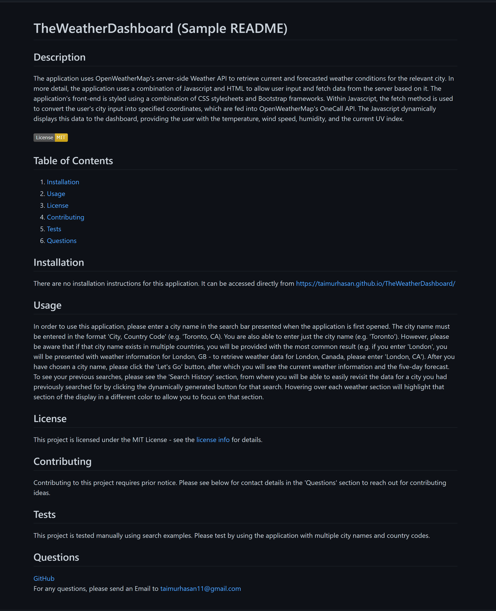

# TheProfessionalREADMEGenerator
## Description
When creating a project on GitHub, it is extremely important to have a high-quality README for the application, which provides details such as what the app is for, how to use it, how to report issues, and how to make contributions. TheProfessionalREADMEGenerator is focused on minimizing the time spent on this aspect of a project by automating its creation. This is a command-line application, which will present you with multiple prompts. Once the prompts are answered, it will dynamically create a README.md file based on user inputs, so that you, a time-constrained developer, can devote more time to the actual project!  
 

## Languages and Technologies Used:
1. JavaScript
2. Node.js
3. NPM (Inquirer)

 

## Table of Contents

1. [ Installation ](#installation)
2. [ Usage ](#usage)
3. [ License ](#license)
4. [ Contributing ](#contributing)
5. [ Tests ](#tests)
6. [ Questions ](#questions)

## Installation
To install and use this application, please follow the steps listed below:  
1. Download the latest version of node.js on your computer.  
2. Clone this repository on your computer by opening your command-line interface and using git clone and the HTTPS or SSH URL retrieved from this repository's 'Code' dropdown above (e.g. 'git clone git@github.com:TaimurHasan/TheProfessionalREADMEGenerator.git').  
3. Navigate or cd into the cloned directory from the CLI (e.g cd ./TheProfessionalREADMEGenerator).  
4. Initialize the npm registry, as it hosts the required package (inquirer) needed to run this application, using 'npm init -y'.  
5. Install the inquirer package into this repository using 'npm i inquier'. 6. Run or call the application using 'node index.js' and follow the prompts as shown on the CLI.

## Usage
To use this application, please follow the steps listed below:  
1. Run the application using node index.js.  
2. Answer the prompts listed on the screen, you will be required to provide an answer to all prompts with the exception of a license, where you can select 'None'.  
3. If the application is successful, you will be presented with the message 'README Created'.  
4. Navigate to the 'dist' sub-directory within the application directory and locate the readme created (file name will match the project name).  
5. Copy this .md document into your personal project directory and edit as needed.

## License
This project is licensed under the MIT License - see the [license info](https://opensource.org/licenses/MIT) for details.

## Contributing

This project can be contributed to by forking the application. For any contributions, please submit a Pull Request, which will be reviewed before merging into the main branch

## Tests
This project can be tested by following the installation and usage details and running the application with your own README details. In
the future, a test.js file will be introduced with a default array of project details to test the
application quickly and efficiently.

## Questions

[GitHub](https://github.com/TaimurHasan) 
For any questions, please send an Email to [taimurhasan11@gmail.com](mailto:taimurhasan11@gmail.com)

## Sample README

Below is an example of a README generated using this application:
